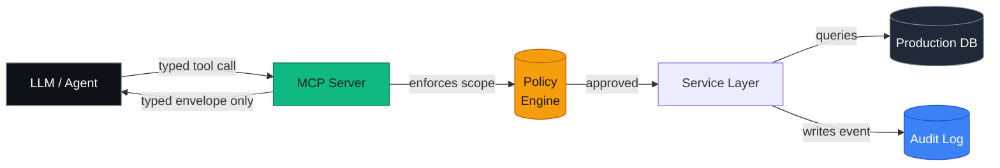
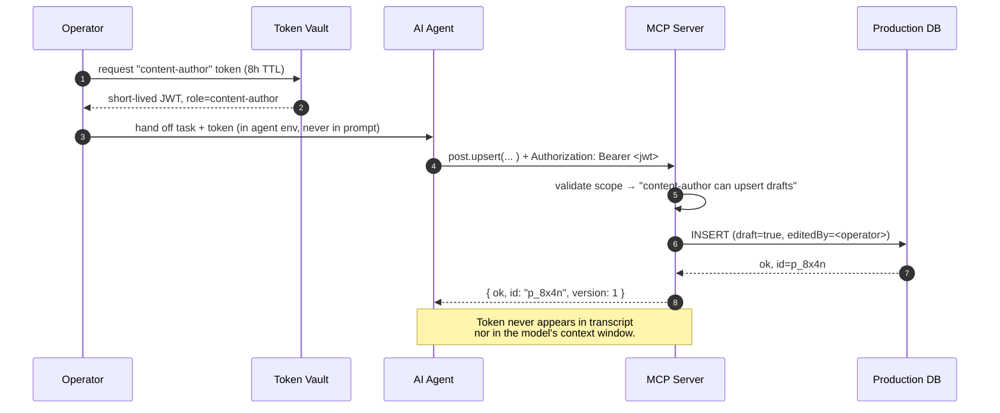
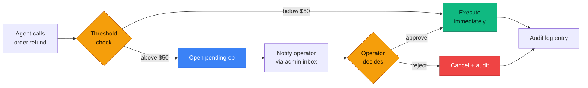

# Letting AI manage your production data without showing it your production data

> **TL;DR** — We use the [Model Context Protocol](https://modelcontextprotocol.io) (MCP) as a capability firewall in front of our production database. The AI gets a typed tool catalog and opaque IDs; it never sees raw rows, secrets, customer PII, payment tokens, or the database URL. Every call is audited, scoped, and reversible. This post walks through the architecture we ship on funimos.pro and the gotchas we hit on the way.

**Slug:** `mcp-as-a-prod-data-firewall`
**Author:** funimos team
**Tags:** `mcp`, `ai`, `security`, `architecture`, `production`
**Cover image:** `/images/blog/mcp-firewall-cover.jpg` *(swap before publish — 1600×900, dark gradient, terminal overlay)*

---

## The temptation, and why it's a trap

Every team building with LLMs hits the same wall around month three: the model is genuinely useful for content ops, support triage, refactor sweeps, even on-call rotation. But it gets *radically* more useful the moment it can touch real data — your real orders, your real customers, your real inventory.

So you do the obvious thing. You hand it a service-account credential. Maybe you scope it to read-only. Maybe you tunnel it through a read-replica. Maybe you tell yourself you'll rotate the token next sprint.

And then one of three things happens:

1. **The token leaks.** It ends up in a prompt log, a transcript, a screenshot, a model provider's training set. Tokens with prod scope are an unbounded liability.
2. **The model improvises.** It runs a query you didn't expect — selecting an entire `users` table because the prompt said "find users with X." Cost spikes, customer PII flows into the model's context, you cannot scrub it out.
3. **You can't tell what it did.** When something goes sideways, your audit log says "service account `ai-bot` executed 412 queries today." Good luck.

We've watched all three happen at different teams. The lesson isn't "don't use AI on prod data." The lesson is **the abstraction is wrong**. Raw database access is the wrong shape of permission to hand an LLM.


*Fig. 1 — Direct DB access. The AI sees too much; secrets and raw rows flow through prompt context; nothing is reversible.*

---

## The shape that actually works

The Model Context Protocol gives you a different shape: instead of access, you expose **capabilities**.

The MCP server lives between the AI and your real data. The AI doesn't see the database; it sees a catalog of named tools (`post.upsert`, `order.refund`, `inventory.adjust`, etc.). Each tool has:

- A typed JSON-schema input.
- A typed output.
- An explicit scope (which records it can touch, which mutations it can perform).
- An audit hook that records every invocation.

When the AI calls `post.upsert({slug: "summer-sale", title: "..."})`, the MCP server resolves the call against your real DB, returns a small typed envelope, and writes a row to the audit log. The AI sees the envelope. It does *not* see the database URL, the connection pool, the secret key that signed the operation, the rows that weren't part of the response, or anything else its prompt didn't strictly need.


*Fig. 2 — MCP-as-firewall. The AI is on the left; production secrets and raw data never cross the green boundary in cleartext.*

The diagram is small but the implication is large: **what crosses the boundary is a typed schema, not a query language.** You can statically reason about what the AI is allowed to ask for. You can deny by default. You can deny shapes you've never seen before.

---

## What the AI sees vs. what it doesn't

Here's a transcript of a real interaction. The AI is asked to publish a new blog post.

> **Operator:** Publish a draft titled "Q3 cleaning checklist" tagged `cleaning,seasonal`. Use the standard intro template.
>
> **Agent:** I'll create the post.
>
> ```json
> // tool call
> {
>   "name": "post.upsert",
>   "arguments": {
>     "slug": "q3-cleaning-checklist",
>     "title": "Q3 cleaning checklist",
>     "tags": ["cleaning", "seasonal"],
>     "body": "...",
>     "draft": true
>   }
> }
> ```
>
> ```json
> // tool result (the only thing the agent receives back)
> {
>   "ok": true,
>   "id": "p_8x4n",
>   "slug": "q3-cleaning-checklist",
>   "version": 1
> }
> ```

That's the whole exchange. Let's break down what was — and crucially *was not* — visible to the model.

| What the AI **sees** | What the AI **never sees** |
| --- | --- |
| The tool catalog (names, schemas, descriptions) | The MongoDB connection string |
| Its own typed inputs and outputs | The service-account password |
| Opaque IDs (`p_8x4n`) | Any other post in the system |
| Scope errors when it tries to overreach | Customer email addresses |
| Per-tool docstrings explaining capability | Payment tokens, Stripe keys, DKIM keys |
| A success/failure flag and an envelope | Server logs, request IDs, trace IDs |
| Idempotency receipts on retries | The DB schema beyond the tool's output type |

The right column is the security boundary. Nothing in the right column needs to exist in the model's context window for the left column to be useful.


*Fig. 3 — Envelope-vs-row. The DB row has 23 fields; the tool envelope has 4. Information leakage is bounded by the schema.*

---

## Scoped tokens — the part teams skip

The MCP server is only as safe as the token the agent uses to authenticate to it. We issue **scoped tokens** with a small, explicit capability set. A token for content ops can publish posts but can't refund orders. A token for support can read order status but can't write to inventory. A token for read-only exploration can't write anything at all.

| Token role | Read scope | Write scope | Sensitive output (e.g., email, address) |
| --- | --- | --- | --- |
| `content-author` | posts, pages, themes | posts (draft only), pages (draft only) | redacted |
| `content-publisher` | posts, pages, themes, releases | posts, pages, releases | redacted |
| `support-readonly` | orders, customers (id+status only) | none | redacted |
| `support-refund` | orders, customers (id+status only) | order.refund (capped at last 90 days) | redacted |
| `ops-inventory` | inventory, products | inventory (delta only) | n/a |
| `audit-readonly` | audit log | none | redacted |

Every token is short-lived (we default to 8 hours) and tied to a human operator who issued it. If the LLM provider has a breach tomorrow, the worst case is "the publisher token from yesterday can publish posts for another 6 hours" — bounded, recoverable, alertable.


*Fig. 4 — Token lifecycle. The JWT lives in the agent's runtime env, never in the prompt. The MCP server is the only thing that ever sees it.*

---

## The operator override loop

For genuinely destructive operations — order refunds above a threshold, mass deletes, theme rollbacks — the MCP server doesn't execute on the AI's say-so alone. It opens a **pending operation** and waits for a human to approve via the admin UI.


*Fig. 5 — Pending ops + operator override. High-risk tool calls become asynchronous; the human is in the loop for anything that can't be cheaply undone.*

The AI sees a `pending` envelope, knows it can't proceed, and can either wait or move on. The operator sees a queued action in their admin inbox with a one-click approve/reject. The audit log records both the AI's intent *and* the operator's decision.


*Fig. 6 — Operator inbox. The human sees what the agent wanted, not just what it did.*

---

## Audit + replay

Every MCP call produces a structured audit row. The schema is the same for every tool, which makes querying trivial:

| Column | Type | Example |
| --- | --- | --- |
| `id` | uuid | `a3b1…` |
| `ts` | timestamp | `2026-05-17T14:02:11Z` |
| `tool` | string | `post.upsert` |
| `operator` | string | `gatis@funimos.pro` |
| `agent` | string | `claude-opus-4-7` |
| `input_hash` | sha256 | `9f2c…` |
| `output_hash` | sha256 | `41ee…` |
| `status` | enum | `ok` / `denied` / `pending` / `cancelled` |
| `latency_ms` | int | `87` |
| `trace_id` | string | `tr_x9k…` |
| `notes` | string | `auto-approved (threshold 50¢)` |

The two hashes matter: they let us replay any call without storing the raw payload. If the audit log itself gets exfiltrated, the attacker doesn't get the post bodies; they get a list of hash-verified operations and timestamps. To replay, you re-fetch the payload from blob storage (which lives behind its own ACL) and verify the hash before re-executing.


*Fig. 7 — 30-day audit volume. Anomalies in tool-call rate (off-hours spikes, unusual operator/agent pairs) feed a daily review queue. None of this is unique to AI — but the AI's high call rate makes it especially valuable here.*

---

## Common pitfalls

We've shipped this on funimos.pro for nine months. The places we tripped:

1. **Don't put PII in tool *descriptions*.** Tool descriptions are visible to the model. We caught ourselves with a description like *"Refund an order — typical use: customer at billing@…@…"*. The example email leaked into every transcript. Use synthetic placeholders.
2. **Don't return a row when the model asked for a count.** If the prompt is "how many orders shipped today?", return `{count: 412}`, not the orders. We started with `findOrders(status: shipped, today)` and the model dutifully ingested 412 customer rows.
3. **Idempotency keys belong on the tool, not the prompt.** If the model is unsure if a publish call worked, you want it to safely retry. Server-side idempotency keys mean retries don't double-publish. We wire ours via a `Idempotency-Key` header the agent must echo.
4. **Schema migrations break tool contracts.** Tools are an API. Treat them like one: version them, deprecate them, never silently change the shape. We had a `customer.create` tool grow a new required field, and an agent started failing in production with no useful error.
5. **The audit log is a product, not a debug log.** Operators need to read it, search it, replay it. We built a small admin surface for browsing audit rows; without it nobody ever looks at the log.
6. **Pending-op timeouts.** What happens to a refund the operator never approved? We default to auto-cancel after 24h. If you don't set a TTL, you'll have a queue of zombie operations from a year ago.


*Fig. 8 — The six pitfalls. Print this out, tape it next to your monitor.*

---

## Try it on funimos.pro

Every funimos.pro site ships with this MCP server baked in. You don't have to build it. Issue a scoped token in the admin (Settings → MCP → Tokens), point your agent at the published MCP endpoint, and the first call your agent makes is `tool.list` — it discovers the catalog automatically.

If you want to verify the firewall is working before you trust it with real data, the `audit-readonly` role is a great place to start. Hand the agent a 1-hour audit-readonly token and ask it to summarize the last day of operator activity. You'll see exactly what it can — and can't — see.

Cheers,
— the funimos team

---

### Appendix — the full tool catalog (excerpt)

| Tool | Read / write | Typical caller | Scope |
| --- | --- | --- | --- |
| `post.list` | read | content-author | tenant-scoped |
| `post.get` | read | content-author | tenant-scoped, by id |
| `post.upsert` | write | content-author | drafts only |
| `post.delete` | write | content-publisher | + cascade rules |
| `page.upsert` | write | content-author | drafts only |
| `theme.activate` | write | content-publisher | rollback supported |
| `release.diff` | read | content-publisher | tenant-scoped |
| `release.publish` | write | content-publisher | pending-op (operator approval) |
| `order.list` | read | support-readonly | last 90d only |
| `order.refund` | write | support-refund | pending-op above $50 |
| `inventory.adjust` | write | ops-inventory | delta only, ±100 cap |
| `audit.list` | read | audit-readonly | redacted output |

> Full catalog: 47 tools across 12 domains. The point isn't the count — it's that you can read this table and reason about what an agent can and cannot do. Try doing that with a raw database credential.
