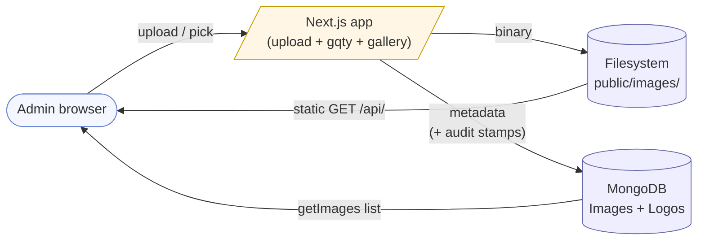
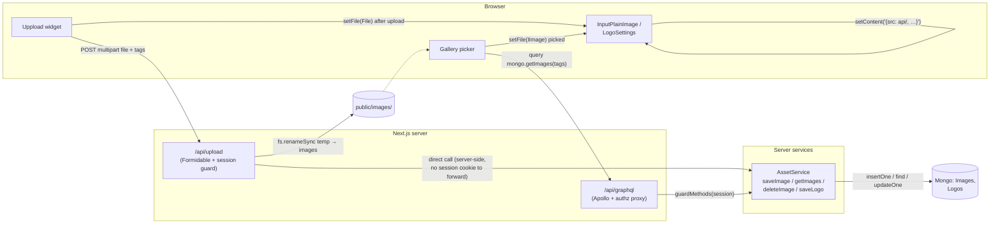
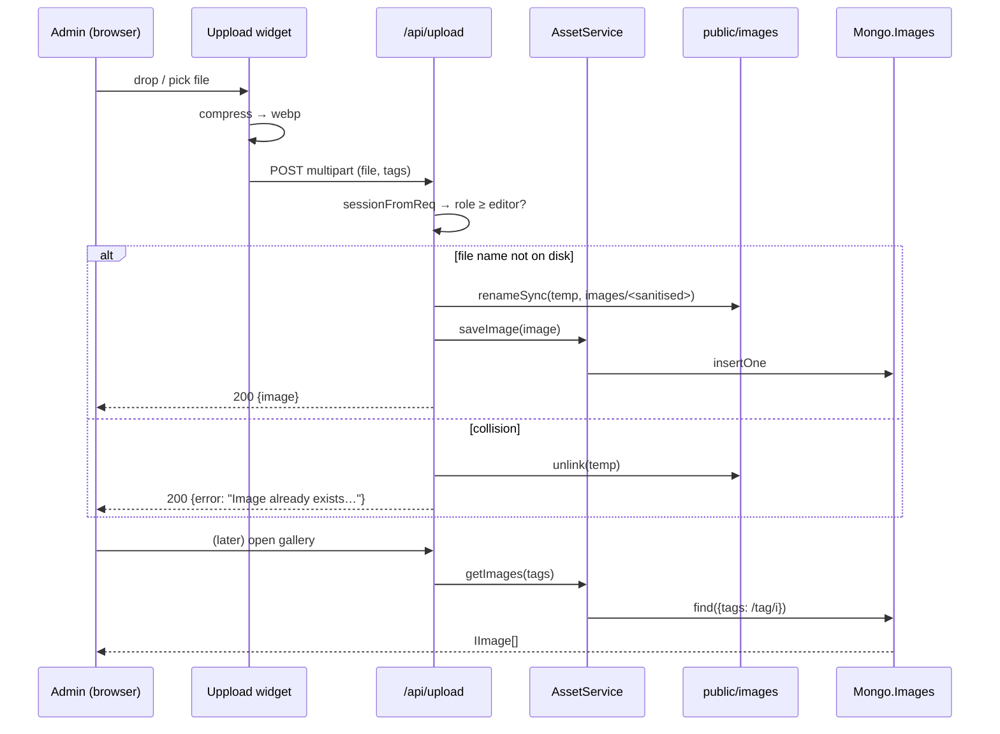

# Project Analysis — redis-node-js-cloud

> **Status note (2026-05-12):** This doc captures the platform analysis as of the F1-F8 ship cycle. Forward direction (storefront program, 8 first-class themes, customer accounts, ss.com cars warehouse, MCP coverage expansion) is in [ROADMAP.md](ROADMAP.md) and [roadmap/README.md](roadmap/README.md). Specific divergences from the analysis below:
>
> - **Themes:** the 4-color + 3-editorial-preset model documented here is being **retired** in favour of **8 first-class designed themes** (editorial / agency / commerce / local-business / restaurant / saas-landing / event / portfolio). See [roadmap/first-class-themes.md](roadmap/storefront/first-class-themes.md).
> - **Token system:** moving to a 3-layer design-token hierarchy (primitive / semantic / component) with `light-dark()` CSS function for mode + per-theme SCSS layer. AntD `cssVar: true` enablement in flight. See [roadmap/project-standards-additions-2026-05-12.md](roadmap/_meta/project-standards-additions-2026-05-12.md).
> - **Motion:** Carbon / Material 3 motion-token system with `--motion-scalar` gating `prefers-reduced-motion`. See [roadmap/motion-token-system.md](roadmap/admin/motion-token-system.md).
> - **Auth:** customer-side `IUser.kind = 'customer'` + `CustomerAuthService` already shipped. Magic-link auth + delayed-account-creation in flight. See [roadmap/client-signup-and-anonymous-checkout.md](roadmap/storefront/client-signup-and-anonymous-checkout.md).
> - **Inventory:** pluggable adapter system shipped with 12 adapters (Postgres/REST/Shopify/Woo/BigCommerce/Square/Airtable/Sheets/NetSuite/SAP/Odoo/Mock); ss.com cars adds one more. See [roadmap/ss-com-cars-integration.md](roadmap/storefront/ss-com-cars-integration.md).
> - **Standards:** 14 new project standards (Sonner / kbar / dnd-kit / motion tokens / cssVar / light-dark / WCAG 2.2 AA / 44 px touch / container queries / EmailService.sendTemplated / data-edit-target / 3-layer tokens / jumps-not-iterations / AI-agent-unit estimates). See [roadmap/project-standards-additions-2026-05-12.md](roadmap/_meta/project-standards-additions-2026-05-12.md).

## Overview

Despite the name, this is a **Next.js 15 / React 19 CMS** backed by **MongoDB** (Redis is present but nearly unused). It ships a developer-portfolio-ready content model: admins compose multilingual pages from **17 reusable item types** (Text / RichText / Image / Gallery / Carousel / Hero / ProjectCard / SkillPills / Timeline / SocialLinks / BlogFeed / **List** / **Services** / **Testimonials** / **StatsCard** / **ProjectGrid** / **Manifesto**), manage a blog (`Posts` collection + `/blog` + `/blog/[slug]` routes), swap AntD themes (with live preview and CSS-variable scoping so only content modules are themed — admin chrome stays static), publish versioned snapshots (with rollback), toggle a `blogEnabled` flag, and customise a site-wide footer that auto-generates columns from navigation + blog. Sections compose via **column-slot merges** (e.g. 66/33 from a 3-col layout) and **absolute-positioned overlays** pinned to six anchor points, both editable inline from the admin chrome.

- **Framework:** Next.js 15 (pages router, Turbopack in dev), React 19, TypeScript 5
- **UI:** Ant Design v5 + custom SCSS; CKEditor 5 is the sole rich-text editor (draft-js + deps removed); IntersectionObserver-based reveal animations; flag-aware language dropdown
- **API:** GraphQL via Apollo Server (Next API route) **and** a standalone Express + `express-graphql` server. Shared resolver map in [graphqlResolvers.ts](src/Server/graphqlResolvers.ts). Method-level authorization proxy ([authz.ts](src/Server/authz.ts)) gates mutations by role + capability, and injects the caller's session into a curated set of methods so they can stamp `publishedBy` / `editedBy` audit fields
- **Data:** MongoDB 7 — collections: `Navigation`, `Sections`, `Images`, `Logos`, `Users`, `Languages`, `Themes`, `SiteSettings` (holds footer / flags / SEO / activeThemeId), `PublishedSnapshots`, `Posts`. Redis still present but nearly unused
- **Auth:** NextAuth (Credentials + optional Google), bcrypt password hashing, JWT sessions carrying `role` + `canPublishProduction`; rate-limited sign-in + same-origin guard on `/api/import`
- **i18n:** `next-i18next`, language detection via `@unly/universal-language-detector`, table editor (single-locale + side-by-side compare) with CSV export/import and merge-on-save so untouched keys aren't wiped
- **Theming:** 7 seeded presets — 4 colour-only (Classic / Ocean / Forest / Midnight) + 3 editorial bundles that restyle every module (**Paper** — Instrument Serif / Inter Tight / JetBrains Mono; **Studio** — Fraunces / Geist; **Industrial** — Barlow Condensed / JetBrains Mono hi-vis yellow on graphite). Editorial presets carry a `themeSlug` token that sets `body[data-theme-name="<slug>"]`, scoping module SCSS to the active theme. `_document.tsx getInitialProps` emits CSS vars inline so first paint already has the active theme.
- **Public layout:** tabs mode (each nav item is its own page) or single-page scroll mode (all pages stacked as `<section id>` anchors), toggled via site flag
- **Audit:** every content-edit mutation (Nav, Section, Theme, Post, Footer, SiteFlags, SiteSeo, Logo, Language) stamps `editedBy` + `editedAt`; publish/rollback stamp `publishedBy` / `rolledBackFrom`
- **Tests:** Vitest + `mongodb-memory-server` + Testing Library — 110 passing tests; CI runs typecheck + `npm test` on every PR ([.github/workflows/ci.yml](.github/workflows/ci.yml))
- **Build/deploy:** Docker Compose (mongodb + standalone GraphQL server + Next app)

## Repository layout

```
.
├── AppDockerfile              Next.js app image
├── ServerDockerfile           Standalone GraphQL server image
├── compose.yaml               mongodb + server + app stack
├── next-i18next.config.js     Locale + translation backend config
├── next-sitemap.config.cjs    Sitemap generation (postbuild)
├── Scripts/                   Helper scripts
├── certificates/              Local SSL certs (sslServer.ts consumes these)
└── src/
    ├── Api/                   Shared API helpers
    ├── Interfaces/            Domain types (IUser, INavigation, ISection, …)
    ├── Server/                Backend — standalone GraphQL + Mongo/Redis
    │   ├── index.ts           Express + express-graphql entry
    │   ├── sslServer.ts       HTTPS variant
    │   ├── schema.graphql     Single source of truth for the GraphQL API
    │   ├── mongoConfig.ts     Settings + service interfaces
    │   ├── mongoDBConnection.ts  Singleton orchestrator that wires the services
    │   ├── UserService.ts     setupAdmin / addUser / getUser
    │   ├── NavigationService.ts  Pages, sections CRUD + nav mutations
    │   ├── AssetService.ts    Logo + images
    │   ├── LanguageService.ts Language + translations
    │   ├── BundleService.ts   Single-file site export/import
    │   ├── fileManager.ts     Filesystem helpers
    │   └── redisConnection.ts Redis client (minimal use)
    ├── frontend/              Next.js app
    │   ├── pages/
    │   │   ├── _app.tsx, _document.tsx
    │   │   ├── index.tsx, app.tsx       Public site shell
    │   │   ├── [...slug].tsx            Dynamic page routing by slug
    │   │   ├── admin.tsx, admin/…       Admin panel
    │   │   └── api/
    │   │       ├── auth/[...nextauth].ts   NextAuth route
    │   │       ├── graphql.ts              Apollo Server (serverless)
    │   │       ├── upload.ts               File upload handler
    │   │       ├── setup.ts                Seed admin user (GET/POST)
    │   │       ├── export.ts               Site bundle download (GET)
    │   │       ├── import.ts               Site bundle upload (POST)
    │   │       └── [name].ts               Catch-all API helper
    │   ├── components/
    │   │   ├── Admin/            AdminApp, AdminSettings (Users/Languages/Theme/Bundle), config inputs
    │   │   ├── Auth/             login-btn
    │   │   ├── SectionComponents/  Gallery, Carousel, RichText, PlainImage, PlainText (+ style enums)
    │   │   ├── itemTypes/        registry.ts — pairs Display + Editor per EItemType
    │   │   ├── common/           Dialogs, wrappers, SectionErrorBoundary, Logo, RichTextEditor
    │   │   └── interfaces/
    │   ├── api/                  Domain gateways over GQty:
    │   │   ├── MongoApi.ts       Thin facade composing the domain APIs
    │   │   ├── UserApi.ts
    │   │   ├── AssetApi.ts
    │   │   ├── LanguageApi.ts
    │   │   ├── NavigationApi.ts
    │   │   └── SectionApi.ts
    │   ├── gqty/                 Generated GraphQL client (schema + fetcher)
    │   ├── theme/, scss/         Styling
    │   ├── public/               Static assets + translations (images served via /api/<name>)
    │   └── pages/api/…
    ├── constants/, enums/, helpers/, utils/   Shared non-domain code (incl. sanitize.ts)
    └── Server/certificates/     Server-side TLS certs
```

## Runtime topology

Two processes can serve the GraphQL schema:

1. **`src/frontend/pages/api/graphql.ts`** — Apollo Server embedded in Next. Shares a single `MongoDBConnection` via `getMongoConnection()`. This is what NextAuth, the frontend, and GQty talk to by default.
2. **`src/Server/index.ts`** — Standalone Express + `express-graphql`, started via `npm run standalone-graphql[-docker]`. Same schema + same singleton, used as the server image in the Docker compose stack.

The Next frontend reaches the GraphQL endpoint through the generated GQty client at [src/frontend/gqty/index.ts](src/frontend/gqty/index.ts). The host URL is derived from `BUILD_PORT`:

- Local dev: `http://localhost:80/api/graphql`
- Docker: `http://server:3000/api/graphql` (the standalone server container)

## Data model (from [schema.graphql](../services/api/schema.graphql))

See also the UML at [architecture/data-model.svg](architecture/data-model.svg).

- **Navigation** (`page`, `type: 'navigation'`, `seo`, ordered `sections[]`, `editedBy?`, `editedAt?`) — the site map. Canonical filter on reads.
- **Section** (`page`, `type`, `content[]`, `editedBy?`, `editedAt?`) — a chunk of a page
- **Item** (`type`, `style`, `content`, plus optional `action*` fields) — one cell within a section
- **Image**, **Logo** — media assets; Logo carries `id` + `type` + `content` (JSON of `{src, width, height}`)
- **User** — `{id, name, email, password, role, avatar, canPublishProduction}`
- **Language** — `{label, symbol, default?, flag?}` with a JSON `translations` blob
- **Theme** — `{id, name, custom, tokens}`; one row in `SiteSettings` holds `activeThemeId`
- **PublishedSnapshot** — frozen copy of Navigation + Sections + Languages + Logos + Images + non-draft Posts; `publishedBy`, `rolledBackFrom`, `note`
- **SiteSettings** (single collection, key-keyed docs): `activeThemeId`, `siteFlags` (`blogEnabled`, `layoutMode`), `footer`, `siteSeo`

Mongo collections: `Navigation`, `Sections`, `Images`, `Logos`, `Users`, `Languages`, `Themes`, `SiteSettings`, `PublishedSnapshots`, `Posts`.

## Authentication flow

1. User hits `/api/auth/signin` → NextAuth page.
2. `CredentialsProvider.authorize` in [[...nextauth].ts](src/frontend/pages/api/auth/[...nextauth].ts) calls `mongoApi.getUser({email})` through GQty → GraphQL `mongo.getUser` → `UserService.getUser`.
3. `bcrypt.compare(submittedPassword, user.password)` — stored hash is precomputed.
4. JWT session (`strategy: "jwt"`), with `id/name/email` copied into the token in the `jwt` callback and re-exposed in `session`.

`GoogleProvider` is only registered when both `AUTH_GOOGLE_ID` and `AUTH_GOOGLE_SECRET` env vars are set — earlier the provider was unconditionally registered with empty strings, which broke the entire `/api/auth/*` handler (Credentials login included) whenever the Google keys were absent.

### Seeded admin

`UserService.setupAdmin()` inserts an admin iff no user with `name: 'Admin'` exists. Seeding is **not automatic** — it happens only when the GraphQL `mongo.setupAdmin` query is executed.

Default admin (see [mongoDBConnection.ts:27-29](src/Server/mongoDBConnection.ts:27)):

| Field    | Value                                                         |
|----------|---------------------------------------------------------------|
| email    | `admin@admin.com`                                             |
| password | `b[ua25cJW2PF` (bcrypt hash stored, `$2b$10$M57z…`)           |

> ⚠️ The plaintext admin password and a MongoDB Atlas connection string with real credentials are checked into [mongoConfig.ts](src/Server/mongoConfig.ts). Rotate these and move them to environment variables.

## Page rendering

- [src/frontend/pages/[...slug].tsx](src/frontend/pages/[...slug].tsx) matches any public path and delegates to `App` ([pages/app.tsx](src/frontend/pages/app.tsx)).
- `App` fetches navigation + sections + posts + footer + active theme via GraphQL on mount, builds an Ant Design `Tabs` of pages, and renders each page as `DynamicTabsContent` → [ContentType](src/frontend/components/common/ContentType.tsx) → registry-based Display component.
- Per-page SEO (`description`, `keywords`, `viewport`, `charSet`, `url`, `image`, etc.) is projected into `<Head>` as `og:*` meta tags.
- Language picker switches to `/{lang}{currentPath}` via `window.location`.
- Blog: [pages/blog/index.tsx](src/frontend/pages/blog/index.tsx) + [pages/blog/[slug].tsx](src/frontend/pages/blog/[slug].tsx) — **SSR via `getServerSideProps`** that hits `/api/graphql` on the build/runtime host. Respects the `blogEnabled` site flag (routes 404 when disabled).
- Footer ([SiteFooter.tsx](src/frontend/components/common/SiteFooter.tsx)) auto-generates "Site" column from navigation pages and "Writing" column from blog (when enabled + posts exist); admin-configured columns stack on top. Custom bottom line. Hide toggle.
- Publishing: the public site can also be served from a versioned snapshot (`PublishedSnapshots` collection) — [PublishService](src/Server/PublishService.ts) copies Navigation/Sections/Languages/Logos/Images/Posts into an immutable doc per Publish; rollback appends a new snapshot that mirrors an older one.

### Rendering mode

| Route | Rendering | Notes |
|---|---|---|
| `/` (index.tsx) | `getStaticProps` → `fetchInitialPageData()` | Nav + sections + footer + theme tokens + languages all baked into HTML for first paint |
| `/[...slug].tsx` | `getStaticProps` + `getStaticPaths` | Per-page static HTML; ISR-friendly |
| `pages/app.tsx` (shared shell) | Receives `initialData`; also primes `<style data-theme-vars>` via [_document.tsx](src/frontend/pages/_document.tsx) | Scroll-mode branch renders pages as stacked `<section id>`; tabs-mode keeps the AntD `Tabs` |
| `/blog` + `/blog/[slug]` | `getServerSideProps` | Honours `blogEnabled` (404 when disabled) |
| `/admin` + `/admin/settings` + `/admin/languages` | `getServerSideProps` primes session + i18n | Locale JSON served with `Cache-Control: no-store` so admin edits take effect on first refresh |
| `postbuild` sitemap | `additionalPaths` in [next-sitemap.config.cjs](next-sitemap.config.cjs) | Resolved from `BUILD_PORT` env var |

## Admin panel

- [pages/admin.tsx](src/frontend/pages/admin.tsx), [pages/admin/settings.tsx](src/frontend/pages/admin/settings.tsx), and [pages/admin/languages.tsx](src/frontend/pages/admin/languages.tsx) — require login; [UserStatusBar.tsx](src/frontend/components/Admin/UserStatusBar.tsx) picks the active view.
- [AdminApp.tsx](src/frontend/components/Admin/AdminApp.tsx) — page tabs carry inline [`AuditBadge`](src/frontend/components/Admin/AuditBadge.tsx) ("last edited by X · 2m ago"), also rendered on every settings tab (Theme/Logo/Posts/Footer/Layout/SEO/Languages); Publish button gated on `canPublishProduction`; Cmd/Ctrl-K palette via [CommandPalette.tsx](src/frontend/components/Admin/CommandPalette.tsx).
- [components/Admin/ConfigComponents/](src/frontend/components/Admin/ConfigComponents/) — per-section-type editors (`InputHero`, `InputProjectCard`, `InputSkillPills`, `InputTimeline`, `InputSocialLinks`, `InputBlogFeed`, plus the Carousel/Gallery/Image/PlainText/RichText editors).
- [components/common/Dialogs/](src/frontend/components/common/Dialogs/) — modals for navigation entries, sections, section items, logo, preview.
- [AdminSettings/](src/frontend/components/Admin/AdminSettings/) — `Users`, `Theme`, `Logo`, `SEO`, `Posts`, `Footer`, `Bundle`, `Publishing`, `Layout` (tabs/scroll toggle). `Languages` has its own route.
- [lib/useAutosave.ts](src/frontend/lib/useAutosave.ts) + [AutosaveStatus.tsx](src/frontend/components/Admin/AutosaveStatus.tsx) — debounced save hook + status pill, ready to wire into forms.

### Style per item (per-module theming hook)

Every content item — regardless of type — carries a free-form `style` field in addition to its `type` + `content`. The editor surfaces it as a third tab in the Edit-content drawer ("Style"), next to "Content" and "Action": a dropdown of the values declared in each type's `styleEnum` (see [itemTypes/registry.ts](src/frontend/components/itemTypes/registry.ts)) plus a second dropdown for the action component's style when an action is configured.

Intended as the **per-module theming slot** — editors pick a named variant; themes and section-level SCSS use `.<module>.<style>` selectors to apply custom borders, backgrounds, typography, or layout tweaks. Each preset bundles its own `styleEnum` so admins only see valid options. A few examples:

- `SkillPills.matrix` — swaps the tag-pill render for an animated capability-matrix bar (used by the Paper theme).
- `Timeline.editorial` / `.alternating` — picks between the paper-style two-column detail grid and an alternating left/right layout.
- `PlainImage.default` vs. a theme's custom value — controls framing / aspect handling.

Adding a new style variant: append the enum value in the relevant `SectionComponents/<Type>.tsx`, then hook it in SCSS (global or theme-scoped via `body[data-theme-name="<slug>"] .<module>.<variant>`). No schema changes needed — `style` is already a first-class string on every `IItem`.

### Section composition — slots, overlay, reorder

Sections aren't just stacked rows. Admins can compose them three ways, all editable inline:

- **Column slot merges** — a section with `type: 3` (three 33% columns) can split into `slots: [2, 1]` → 66/33, `[1, 2]` → 33/66, etc. Same story for `type: 4` (any permutation that sums to 4). Hover a section to reveal the **merge-with-next** (◀) / **split** (▶) chips on each slot edge; merging keeps the left item and drops the right, splitting inserts empty slots. Stored as `ISection.slots: number[]`; validated server-side (`sum(slots) === type` + `slots.length === content.length`). See [SectionContent.tsx](src/frontend/components/SectionContent.tsx) for the grid render + chip placement.
- **Overlay + anchor** — any section can be flagged `overlay: true` with `overlayAnchor` = `top-left | top-right | bottom-left | bottom-right | center | fill`. The section drops out of block flow and renders as an absolute-positioned child of the previous non-overlay ("host") section. [DynamicTabsContent.renderGroupedSections](src/frontend/components/DynamicTabsContent.tsx) groups consecutive overlay sections under their host; the host gets `position: relative` via `.section-host`; CSS anchors live in [scss/global.scss](src/frontend/scss/global.scss) (`.section-overlay--<anchor>`). Admin chrome carries a hover-revealed segmented control per section (`Off / ◤ ◥ ◣ ◢ / ✦ / ▣`) that mutates these fields through the existing `addUpdateSectionItem` mutation, with undo ticket support.
- **Reorder (native HTML5 DnD)** — [DraggableWrapper](src/frontend/components/common/DraggableWrapper.tsx) renders a pulsing accent-bordered 48px placeholder at the exact drop slot during a drag; the dragged section itself fades to 40% opacity with a tiny scale-down. Target position updates are `requestAnimationFrame`-throttled so adjacent-section hover doesn't flicker. On drop, `NavigationService.getSections` re-sorts the `$in`-fetched docs by the caller's id order so the new layout sticks through the refresh.

### Action per item (interaction hook)

Every item also carries an **Action** section — the second tab in the Edit-content drawer — which configures what happens when the item is interacted with (currently "No action" / "On click"; more triggers planned, e.g. hover, scroll-into-view, intersection-observer reveal, keyboard shortcut).

When an action is configured the editor picks:
- `action` — the trigger (`none` / `onClick` / future additions).
- `actionType` — the item type of the content that the action surfaces. **Any** registered module can be used as an action target: click an image → pop open a Gallery; click a text → slide in a RichText; click a button → reveal a BlogFeed preview. Same registry, same editor, so "an action is just another module hanging off a trigger".
- `actionContent` — the full content JSON for that nested module, edited inline via the same editor as the outer module.
- `actionStyle` — **separate style slot** for the action component, exposed as the second dropdown on the "Style" tab ("Please select style for action component"). Lets editors tune the triggered module independently of its standalone appearance — e.g. a Gallery used as an inline block gets one treatment, the same Gallery used as an onClick overlay gets another.

Runtime: [ContentType](src/frontend/components/common/ContentType.tsx) renders the outer module; when the parent wrapper observes an action-enabled class (`content-wrapper.action-enabled`) and the trigger fires, an `ActionDialog` (or equivalent surface) mounts the inner module using the stored `actionType` + `actionContent` + `actionStyle`. The action-component style is what the triggered module uses — its own regular `style` field is ignored in this context, so a Gallery rendered via an action follows `actionStyle`, not `style`.

Adding a new action trigger: extend the trigger enum in [ConfigComponents](src/frontend/components/Admin/ConfigComponents/), wire the corresponding DOM handler on the render path in [ContentType](src/frontend/components/common/ContentType.tsx) (or a sibling wrapper), and — if the trigger needs its own CSS-driven state — scope styles through the `actionStyle` the editor picks.

## Scripts ([package.json](package.json))

| Script | Purpose |
|---|---|
| `dev` | `next dev --turbo -p 80 src/frontend` |
| `build` | Production Next build |
| `build-docker` | Production build with `BUILD_PORT=3000` |
| `start` / `start-docker` | Production run on port 80 |
| `postbuild` | `next-sitemap` generation |
| `dev-server` | Nodemon-watched standalone GraphQL |
| `standalone-graphql` | Run [Server/index.ts](src/Server/index.ts) directly via `tsx` |
| `standalone-graphql-docker` | Same, with container-internal port 3000 |
| `ssl` | Run HTTPS variant (`sslServer.ts`) |
| `generate-schema` | Regenerate GQty client from a running GraphQL endpoint |
| `lint` | ESLint with `--fix` |
| `clean` | Remove `.next` cache |

## Docker

[compose.yaml](compose.yaml) wires three services on three networks (`db`, `back-end`, `front-end`):

- **mongodb** (mongo:7.0) — no auth configured on the container, but the code speaks to `mongodb://mongodb:27017` inside Docker or `localhost:27017` outside.
- **server** — standalone GraphQL on port 3000; healthchecked via `?query={sample}`.
- **app** — Next app on port 80; depends on `server` being healthy.

The app container uses `BUILD_PORT=3000` so the GQty fetcher resolves `http://server:3000/api/graphql`.

## Bundle export/import

Entire site (navigation, sections, languages, logo, images metadata, + referenced local image binaries as base64) is a single JSON file. See [BundleService.ts](src/Server/BundleService.ts).

- `GET /api/export` → `site-YYYY-MM-DD.json` download. Only locally-served images (`api/<name>`) are inlined; third-party URLs stay as URLs.
- `POST /api/import` accepts a bundle JSON; validates manifest version, shape, per-asset filename allowlist (`^[\w.\-]+\.(jpg|jpeg|png|gif|webp|svg)$`), and size cap (25 MB / asset). Wipes + restores collections; writes assets to `src/frontend/public/images/` after a `path.resolve()` containment check. Returns `{restored, assets, skippedAssets[]}`.
- Admin UI: Settings → Bundle tab with Download button + file picker + danger-confirmed Apply.

## Content safeguards

- **Error boundary per section** — [SectionErrorBoundary](src/frontend/components/common/SectionErrorBoundary.tsx) isolates render failures; one malformed section no longer blanks the whole page.
- **HTML sanitization** — [sanitizeHtml](src/utils/sanitize.ts) is applied to `RichText` before `innerHTML` assignment. Strips `<script>`/`<iframe>`/`<style>` tags, inline event handlers, and `javascript:`/`data:`/`vbscript:` URLs on `href`/`src`/`action`. Upgrade path: DOMPurify.
- **Bundle import validation** — see above.
- **Defensive parsing** — translation utils guard against non-string content (`typeof html !== 'string'`); `MongoApi.getLogo` returns a safe empty shape when null.

## Asset / image pipeline

High-level — one picture of where an image lives:



Zoomed in:





Images and the single logo are served as static files from `src/frontend/public/images/` and catalogued in the `Images` collection. Two entry points touch them:

- **`POST /api/upload`** ([pages/api/upload.ts](src/frontend/pages/api/upload.ts)) — multipart upload. Formidable parses into `public/temp/`, then the handler renames the file into `public/images/<originalFilename with spaces→underscores>`. If a file with that target name already exists on disk, the temp file is deleted and a `{error: "Image already exists..."}` response is returned. On success, `AssetService.saveImage` is called **directly** (not via the GraphQL gateway) to insert the metadata doc `{id, name, location: "api/<name>", size, type, tags, created}`. Response: `{fields, files, image}`.
  - Why direct? The upload API runs server-side; fetching `/api/graphql` from there does not forward the caller's NextAuth cookie, so the mutation would hit [authz.ts](src/Server/authz.ts) as `role: 'viewer'` and `saveImage` (requires `editor`) would 403. Files would land on disk while the DB insert silently failed.
  - The upload endpoint itself guards on `sessionFromReq` and rejects anyone below `editor`.
- **`POST /api/graphql → saveImage / deleteImage / getImages`** — used by the browser gallery for listing and deletion. Goes through the authz proxy → `AssetService`.

Client side:

- **[ImageUpload.tsx](src/frontend/components/ImageUpload.tsx)** — wrapping the Uppload widget. Two paths converge into the same `setFile(file)` callback: (1) a freshly uploaded `File` from the widget (after Uppload calls `_setFile` from its `uploader` function in [UpploadeManager.ts](src/frontend/Classes/UpploadeManager.ts), which also `fetch('/api/upload')`s the same binary), and (2) a gallery-picked `IImage` from the list. Callers (`InputPlainImage`, `LogoSettings`) reconstruct the public path as `PUBLIC_IMAGE_PATH + file.name` (i.e. `api/<name>`).
- **Gallery refresh** — `loadImages()` re-runs on `dialogOpen` changes only. Newly uploaded images appear the next time the picker is opened; no live push.
- **Tags** — `UpploadManager` defaults to `['All']`; the client POSTs `tags` as JSON. `AssetService.getImages` queries `{tags: {$regex: tags, $options: 'i'}}`, which Mongo applies element-wise across each doc's `tags` array. Searching "All" matches uploads that retained the default tag.

Logo (`Logos` collection, single doc) flows through `AssetService.saveLogo / getLogo` via GraphQL (session-aware authz applies), stamping `editedBy` + `editedAt` like other settings docs.

Known gaps worth addressing (see ROADMAP for current status):

- Disk-existence check compares against `originalFilename` including spaces but the stored file uses underscores — so re-uploading the same filename with spaces repeatedly would bypass the "already exists" short-circuit.
- `UpploadManager.setTags` assigns to a local `upploadManager` variable re-declared on every render of `ImageUpload`, so user-edited tags may not reach the instance bound at mount time.
- `setFile` is invoked synchronously when Uppload's `uploader` resolves, but the actual HTTP upload fetch is fire-and-forget inside the same function — if it fails mid-flight the disk file exists without a DB row.

## Notable issues / smells (remaining)

1. **Duplicated GraphQL surface** — Apollo (Next route) and `express-graphql` (standalone) both serve the same schema. Resolver map is now centralized in [graphqlResolvers.ts](src/Server/graphqlResolvers.ts) to prevent drift. Standalone binds 127.0.0.1 by default and rejects non-loopback traffic unless `STANDALONE_ALLOW_REMOTE=1` is set.
2. **Redis all but unused** — only `getBar`. Either wire it into caching/session storage or remove to simplify the stack (and the repo name).
3. **`[...slug].tsx` + `app.tsx`** — `app.tsx` doubles as both an internal page and the shell re-exported into `Slug`. Cleaner to have a layout + page split.
4. ~~**Manual GQty client patches**~~ — **resolved**. `schema.generated.ts` regenerated cleanly via `npm run generate-schema` against the live `/api/graphql` endpoint; every previously hand-patched field (logo nullability, `getSiteSeo`/`saveSiteSeo`, `INewLanguage.flag`, `ILogo.id`/`type`, audit fields, composition fields `slots`/`overlay`/`overlayAnchor`, `IUser.preferredAdminLocale`/`mustChangePassword`) is now emitted by introspection from `schema.graphql`. Re-running the generator is a no-op.
5. ~~**`sanitizeKey` regex bug**~~ — **resolved**. [`sanitizeKey`](src/utils/stringFunctions.ts) now uses the correct character class (v1 regex dropped) and appends a 6-char djb2 hash suffix when the stripped content exceeds 30 chars, so two long strings sharing a 30-char prefix no longer collide into the same translation key.

## Resolved (since initial analysis)

- ~~Per-request Mongo clients~~ — now a singleton via `getMongoConnection()`.
- ~~`UserService.setupAdmin` returns null on first insert~~ — now returns the newly created document.
- ~~Uncommitted service split~~ — services landed (User, Navigation, Asset, Language, Bundle, Publish, Theme, Post, Footer, SiteFlags, SiteSeo) + shared [audit.ts](src/Server/audit.ts) helper.
- ~~Missing auto-seed~~ — `setupAdmin()` auto-runs on first successful Mongo connect + `/api/setup` endpoint.
- ~~Duplicated editor stacks~~ — draft-js + deps removed; CKEditor 5 is the sole rich-text editor.
- ~~CRA-era polyfills~~ — `crypto-browserify`, `node-polyfill-webpack-plugin`, `buffer`, `util`, `url` uninstalled.
- ~~Hardcoded secrets~~ — admin password + Mongo Atlas credentials moved behind env vars (`.env.example` covers every supported variable).
- ~~Stale README~~ — replaced with a real intro (see [README.md](README.md)).

## Known framework constraints

These are baked into the framework (Next.js Pages Router) and not worth re-litigating without a corresponding business reason. Captured here so future readers don't re-derive the constraint.

- **Customer pages cannot use slugs `admin` or `api`.** Pages Router resolves filesystem routes (`pages/admin.tsx`, `pages/api/*`) before the catch-all `pages/[lang]/[...slug].tsx` runs. If a customer creates a page with slug `admin` or `api`, the request is intercepted by the platform's static route, never reaching the public catch-all. Reserved-slug enforcement on input is the simplest mitigation; documented in the page-create flow.
- **`pages/api/*` is a Next.js special case** — the directory name is load-bearing. Files there are server-only API routes; files anywhere else (including `pages/v1/api/*`) are treated as React pages and bundled for the browser, which silently pulls Mongo / Redis / Node-only modules into the client chunk and breaks the build (or, worse, ships server code to browsers). The 2026-05-03 F3 attempt to move the directory failed for this reason — see [roadmap/v1-url-namespace.md](roadmap/platform/v1-url-namespace.md) postmortem.
- **The unlock if root-URL freedom ever becomes a hard requirement** is either (a) Next.js App Router migration (`app/*/route.ts` handlers + `app/[...slug]/page.tsx` catch-all — App Router doesn't have the same file-system-as-URL precedence), or (b) a custom skeleton/architecture not built on Next.js at all. Per the user's 2026-05-03 stance: "idea is good, but need a custom skeleton/architecture, probably for future when we go away from nextjs." Not worth building speculatively. The F3 spec + postmortem at [roadmap/v1-url-namespace.md](roadmap/platform/v1-url-namespace.md) preserves the design thinking so it's ready when that migration is on the table.

## Suggested next steps

See [ROADMAP.md](ROADMAP.md) for the remaining feature plan — admin i18n decouple (held), translation context/inline editing, admin UX phase 2 (sidebar, drawer, DnD upgrade, undo, templates, high-contrast, icon consolidation), edit-audit UI surfacing on settings tabs, remaining frontend + API-route tests.
