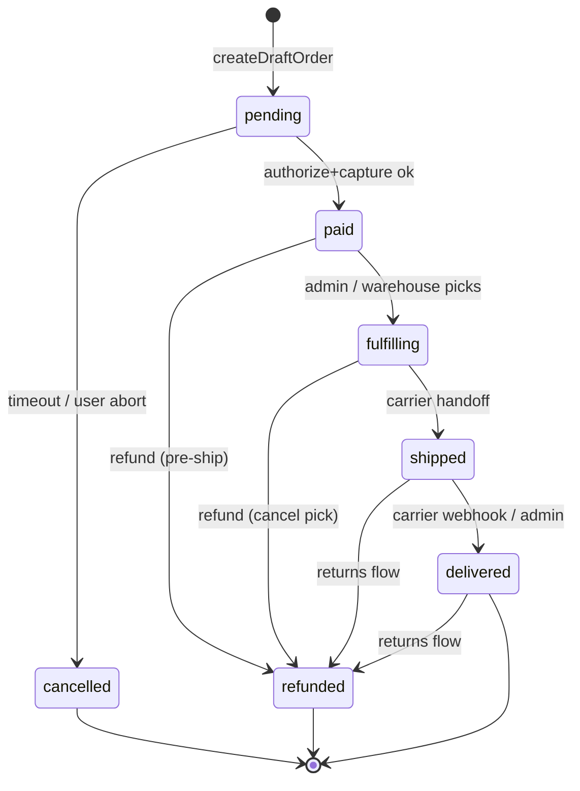

# Checkout & Orders

Status: Draft
Owner: Commerce
Related: ../core/authentication.md, ./products.md, ./cart.md, ./inventory-warehouse.md, ./customer-auth.md

## 1. Overview

Amazon-style multi-step checkout (cart → address → shipping → payment → review → confirmation) backed by a new `Orders` Mongo collection. Payment is abstracted behind `IPaymentProvider`; the only concrete provider for now is `MockPaymentProvider`. A real provider (Stripe) drops in later without touching callers.

This module *consumes* the Cart, Products, Inventory, and customer-Auth modules. Their interfaces are assumed to exist; this spec does not redesign them.

## 2. Data Model

Collection: `Orders` (one document per order).

```ts
// shared/types/IOrder.ts (planned)
export type OrderStatus =
    | 'pending'      // draft created, no payment yet
    | 'paid'         // payment authorized + captured
    | 'fulfilling'   // warehouse picking
    | 'shipped'      // carrier handoff
    | 'delivered'    // confirmed delivered
    | 'cancelled'    // cancelled before shipment
    | 'refunded';    // money returned post-capture

export interface IOrderLineItem {
    productId: string;
    sku: string;
    title: string;            // snapshot
    image?: string;           // snapshot
    quantity: number;
    unitPrice: number;        // priceSnapshot, minor units
    lineTotal: number;
    taxAmount?: number;
}

export interface IOrderAddress {
    name: string;
    line1: string;
    line2?: string;
    city: string;
    region: string;
    postalCode: string;
    country: string;          // ISO-3166 alpha-2
    phone?: string;
}

export interface IOrderStatusEntry {
    status: OrderStatus;
    at: string;               // ISO
    by?: string;              // user email or 'system' / 'mock-payment'
    note?: string;
}

export interface IOrder {
    id: string;               // guid()
    orderNumber: string;      // human-readable, e.g. "ORD-2026-000123"
    customerId?: string;      // null for guest
    guestEmail?: string;
    orderToken?: string;      // opaque, set for guest orders (cookie-bound)

    lineItems: IOrderLineItem[];
    subtotal: number;
    shippingTotal: number;
    taxTotal: number;
    discountTotal: number;
    total: number;
    currency: string;

    shippingAddress?: IOrderAddress;
    billingAddress?: IOrderAddress;
    shippingMethod?: { code: string; label: string; price: number; etaDays: number };

    paymentRef?: {
        provider: 'mock' | 'stripe';
        authorizationId?: string;
        captureId?: string;
        last4?: string;
        brand?: string;
    };
    idempotencyKeys: { authorize?: string; finalize?: string };

    status: OrderStatus;
    statusHistory: IOrderStatusEntry[];

    inventoryReservationId?: string;

    createdAt: string;
    updatedAt: string;
    version: number;
}
```

Indexes:
- `{ id: 1 }` unique
- `{ orderNumber: 1 }` unique
- `{ customerId: 1, createdAt: -1 }` (history)
- `{ status: 1, updatedAt: -1 }` (admin list)
- `{ 'paymentRef.authorizationId': 1 }` sparse (webhook lookups)
- `{ orderToken: 1 }` sparse, unique (guest confirmation)

## 3. Order State Machine



Transitions are enforced in `OrderService.transition(id, next, by)`. Invalid transitions throw. Every transition appends to `statusHistory`.

## 4. Payment Provider Abstraction

`services/features/Orders/payment/IPaymentProvider.ts`:

```ts
export interface AuthorizeArgs {
    amount: number;          // minor units
    currency: string;
    card: { number: string; exp: string; cvc: string; name?: string };
    idempotencyKey: string;
    metadata?: Record<string, string>;
}
export interface AuthorizeResult {
    ok: boolean;
    authorizationId?: string;
    declineCode?: string;
    last4?: string;
    brand?: string;
}
export interface IPaymentProvider {
    name: 'mock' | 'stripe';
    authorize(args: AuthorizeArgs): Promise<AuthorizeResult>;
    capture(authorizationId: string, idempotencyKey: string): Promise<{ok: boolean; captureId?: string}>;
    refund(captureId: string, amount: number, idempotencyKey: string): Promise<{ok: boolean; refundId?: string}>;
}
```

`MockPaymentProvider`:
- `authorize` returns `ok:true` always, except card `4000000000000002` → `{ok:false, declineCode:'card_declined'}`.
- IDs are `mock_auth_<guid>`, `mock_cap_<guid>`, `mock_rfn_<guid>`.
- Idempotency: in-memory `Map<idempotencyKey, result>` so retries are stable within a process.

Stripe slot-in: a future `StripePaymentProvider` implements the same interface. Selection is a single env switch in `services/features/Orders/payment/index.ts`:

```ts
export function getPaymentProvider(): IPaymentProvider {
    return process.env.PAYMENT_PROVIDER === 'stripe'
        ? new StripePaymentProvider(process.env.STRIPE_SECRET_KEY!)
        : new MockPaymentProvider();
}
```

No caller code changes when Stripe lands.

## 5. Checkout Flow

All endpoints live under GraphQL (no REST), and accept an `idempotencyKey: String!` on the mutating ones. The flow:

| Step | Mutation | Effect |
|------|----------|--------|
| 1 | `createDraftOrder(cartId, currency)` | Snapshots cart → Order with `status:pending`. Reserves stock (see 6). |
| 2 | `attachOrderAddress(orderId, shipping, billing)` | Validates, computes tax stub. |
| 3 | `attachOrderShipping(orderId, methodCode)` | Computes `shippingTotal`, recomputes `total`. |
| 4 | `authorizeOrderPayment(orderId, card, idempotencyKey)` | Calls `provider.authorize`. On success stores `paymentRef`. On decline: order stays `pending`, returns `declineCode`. |
| 5 | `finalizeOrder(orderId, idempotencyKey)` | Calls `provider.capture`, transitions `pending → paid`, sends confirmation email, clears the cart, confirms the inventory reservation. |

Idempotency: `idempotencyKey` is stored on the order (`idempotencyKeys.authorize`, `idempotencyKeys.finalize`). Resubmits with the same key are no-ops returning the prior result.

Drafts older than 30 minutes without payment are swept by a cron (`scripts/sweepOrders.ts`) and transitioned `pending → cancelled`, releasing the reservation.

## 6. Stock Reservation

Decision: **reserve at draft creation, confirm on payment finalize, release on cancel/timeout.**

- `createDraftOrder` calls `Inventory.reserve(lineItems, ttl=30m)` and stores the returned `inventoryReservationId`.
- `finalizeOrder` calls `Inventory.confirm(reservationId)` (turns reservation into a committed allocation).
- Sweeper / explicit cancel calls `Inventory.release(reservationId)`.
- If `Inventory.reserve` fails (oversold), `createDraftOrder` throws `OrderError('OUT_OF_STOCK', { sku })` with the specific SKUs.

Rationale: reserving at draft is more user-friendly (price/stock locked through the multi-step flow), at the cost of needing the sweeper. Reserving at authorize would risk losing the sale between steps 3 and 4.

## 7. GraphQL

Additions to `services/api/schema.graphql`:

```graphql
enum OrderStatus { pending paid fulfilling shipped delivered cancelled refunded }

type OrderLineItem {
    productId: ID!
    sku: String!
    title: String!
    image: String
    quantity: Int!
    unitPrice: Int!
    lineTotal: Int!
    taxAmount: Int
}

type OrderAddress {
    name: String!
    line1: String!
    line2: String
    city: String!
    region: String!
    postalCode: String!
    country: String!
    phone: String
}

type ShippingMethod { code: String! label: String! price: Int! etaDays: Int! }

type PaymentRef { provider: String! authorizationId: String captureId: String last4: String brand: String }

type OrderStatusEntry { status: OrderStatus! at: String! by: String note: String }

type Order {
    id: ID!
    orderNumber: String!
    customerId: ID
    guestEmail: String
    lineItems: [OrderLineItem!]!
    subtotal: Int!
    shippingTotal: Int!
    taxTotal: Int!
    discountTotal: Int!
    total: Int!
    currency: String!
    shippingAddress: OrderAddress
    billingAddress: OrderAddress
    shippingMethod: ShippingMethod
    paymentRef: PaymentRef
    status: OrderStatus!
    statusHistory: [OrderStatusEntry!]!
    createdAt: String!
    updatedAt: String!
    version: Int!
}

input AddressInput { name: String! line1: String! line2: String city: String! region: String! postalCode: String! country: String! phone: String }
input CardInput { number: String! exp: String! cvc: String! name: String }

type AuthorizeResult { ok: Boolean! orderId: ID! declineCode: String }

extend type Query {
    myOrders(limit: Int = 25): [Order!]!         # customer
    myOrder(id: ID!): Order                      # customer
    orderByToken(token: String!): Order          # guest confirmation page
    adminOrders(status: OrderStatus, limit: Int = 50): [Order!]!  # admin
    adminOrder(id: ID!): Order                                    # admin
    shippingMethodsFor(orderId: ID!): [ShippingMethod!]!
}

extend type Mutation {
    createDraftOrder(cartId: ID!, currency: String!, guestEmail: String): Order!
    attachOrderAddress(orderId: ID!, shipping: AddressInput!, billing: AddressInput): Order!
    attachOrderShipping(orderId: ID!, methodCode: String!): Order!
    authorizeOrderPayment(orderId: ID!, card: CardInput!, idempotencyKey: String!): AuthorizeResult!
    finalizeOrder(orderId: ID!, idempotencyKey: String!): Order!
    cancelOrder(orderId: ID!): Order!
    adminTransitionOrder(orderId: ID!, next: OrderStatus!, note: String): Order!  # admin
    adminRefundOrder(orderId: ID!, amount: Int, reason: String): Order!           # admin
}
```

Resolver signatures (`services/api/resolvers/orders.ts`):

```ts
Query.myOrders        = (_, {limit}, ctx) => orderService.listForCustomer(ctx.session.customerId, limit);
Query.myOrder         = (_, {id}, ctx)    => orderService.getForCustomer(id, ctx.session.customerId);
Query.orderByToken    = (_, {token}, ctx) => orderService.getByToken(token, ctx.req.cookies['order_token']);
Query.adminOrders     = (_, {status, limit}, ctx) => adminGuard(ctx).listAll({status, limit});
Query.adminOrder      = (_, {id}, ctx)    => adminGuard(ctx).getById(id);

Mutation.createDraftOrder       = (_, args, ctx) => orderService.createDraft({...args, session: ctx.session});
Mutation.attachOrderAddress     = (_, args, ctx) => orderService.attachAddress(args, ctx.session);
Mutation.attachOrderShipping    = (_, args, ctx) => orderService.attachShipping(args, ctx.session);
Mutation.authorizeOrderPayment  = (_, args, ctx) => orderService.authorize(args, ctx.session);
Mutation.finalizeOrder          = (_, args, ctx) => orderService.finalize(args, ctx.session);
Mutation.cancelOrder            = (_, args, ctx) => orderService.cancel(args, ctx.session);
Mutation.adminTransitionOrder   = (_, args, ctx) => adminGuard(ctx).transition(args);
Mutation.adminRefundOrder       = (_, args, ctx) => adminGuard(ctx).refund(args);
```

## 8. Authz

Extends `services/features/Auth/authz.ts`:

- Customer queries (`myOrders`, `myOrder`): require `ctx.session.customerId` (customer auth, not the admin role rank). Service enforces `order.customerId === session.customerId`.
- Guest confirmation: `orderByToken` matches the `token` arg against the `order_token` HTTP-only cookie set by `finalizeOrder` for guest orders. Cookie is `Path=/checkout; SameSite=Lax; HttpOnly; Max-Age=86400`.
- Admin queries/mutations (`adminOrders`, `adminOrder`, `adminTransitionOrder`, `adminRefundOrder`): added to `QUERY_REQUIREMENTS` / `MUTATION_REQUIREMENTS` with role `'editor'` (refund → `'admin'`).
- Admin mutations are session-injected (added to `SESSION_INJECTED_METHODS`) so `statusHistory[].by` is stamped with the admin's email.

## 9. Public UI

Routes under `ui/client/pages/checkout/`:

- `index.tsx` — cart review, "Proceed to checkout"
- `address.tsx` — shipping + billing forms, saved-address picker for signed-in customers
- `shipping.tsx` — method picker, shows ETA + price
- `payment.tsx` — card form (mock-aware: shows the `4000...0002` decline card as a hint in dev)
- `review.tsx` — line items + totals + "Place order"
- `confirmation/[id].tsx` — reads order via `myOrder` (customer) or `orderByToken` + cookie (guest)

Account pages:
- `ui/client/pages/account/orders/index.tsx` — history list
- `ui/client/pages/account/orders/[id].tsx` — detail + status timeline

Step state lives in a `useCheckoutMachine` hook (XState-style reducer, no new dep) keyed off `orderId` so reload resumes mid-flow.

## 10. Admin UI

Under `ui/admin/features/orders/`:

- `OrdersListPage.tsx` — table: orderNumber, customer, total, status, createdAt; filters by status and date range.
- `OrderDetailPage.tsx` — line items, addresses, payment ref, status timeline, action buttons:
    - "Mark fulfilling" / "Mark shipped (tracking#)" / "Mark delivered"
    - "Cancel order" (only if pending/paid)
    - "Refund" (only if paid/fulfilling/shipped/delivered, admin-only)

Follows the existing admin feature shape.

## 11. Email

Reuses the existing nodemailer setup found in `ui/client/pages/api/_inquiryMailer.ts` (transport factory). Add `services/features/Orders/email/orderMailer.ts` that imports the same transport.

Templates (HTML + text, in `services/features/Orders/email/templates/`):
- `order-confirmation` — sent on `pending → paid`
- `order-shipped` — sent on `fulfilling → shipped` (includes tracking)
- `order-delivered` — sent on `shipped → delivered`
- `order-refunded` — sent on `* → refunded`

Sent to `customer.email` or `guestEmail`. Mailer failures are logged but do NOT roll back the order.

## 12. Test Plan

`services/features/Orders/OrderService.test.ts` using `mongodb-memory-server`.

Unit:
- `MockPaymentProvider.authorize` returns ok for normal card, decline for `4000000000000002`, idempotent on duplicate key.
- State-machine: every legal transition allowed; every illegal one throws.
- Authz: customer A cannot read customer B's order; guest token mismatch rejected.
- Idempotency: repeating `authorizeOrderPayment` with the same key produces one provider call.

Integration (full happy-path):
1. Seed product + inventory, create cart with 2 SKUs.
2. `createDraftOrder` → assert `status:pending`, reservation created.
3. `attachOrderAddress`, `attachOrderShipping` → totals recompute.
4. `authorizeOrderPayment` with good card → `ok:true`, paymentRef set.
5. `finalizeOrder` → `status:paid`, cart cleared, reservation confirmed, confirmation email queued (assert via fake transport spy).
6. Replay `finalizeOrder` with same idempotencyKey → no double capture.

Decline path: same flow with `4000000000000002` → step 4 returns `declineCode:'card_declined'`, order stays `pending`, reservation still held, retry with a good card succeeds.

Sweep path: fast-forward time, run sweeper → `pending → cancelled`, `Inventory.release` called.

## 13. Open Questions

1. **Tax** — flat-rate stub per country, or integrate a tax service from day one? Spec assumes a stub.
2. **Shipping rates** — hardcoded methods (standard/express) or carrier-rate lookup? Spec assumes hardcoded.
3. **Guest checkout** — allowed? Spec assumes yes, gated by a `siteFlags.allowGuestCheckout` toggle (default on).
4. **Currency** — single (`USD`) or multi? Spec stores `currency` per order but the UI only offers one until a Pricing module exists.
5. **Order number format** — `ORD-YYYY-NNNNNN` (year-scoped sequence) vs pure guid?
6. **Refund granularity** — line-item-level partial refunds or whole-order only?
7. **PCI scope** — even with mock, the card form posts raw PAN to our server. For Stripe drop-in we'll need to switch the payment step to Stripe Elements before going live.

---

## Implementation status

Status as of 2026-04-29: **shipped on `develop`** (uncommitted).

Implemented per spec. Decisions taken:
- Tax: flat-rate per-country stub (`US 0`, `LV 0.21`, `DE 0.19`, default 0) (Q1).
- Shipping: hardcoded `standard` ($5/5d) and `express` ($15/1d) (Q2).
- Guest checkout allowed, gated by `siteFlags.allowGuestCheckout` (default on) (Q3).
- Single currency per order; UI offers `USD` only for now (Q4).
- Order number `ORD-YYYY-NNNNNN` via atomic Mongo counter (Q5).
- Whole-order refunds only in v1 (Q6).
- Mock card form posts raw PAN to server — acceptable for `MockPaymentProvider`; will swap to Stripe Elements before going live (Q7).
- Stock decrement at confirm-time only (held reservations don't move stock); atomic `findOneAndUpdate` with `{stock: {$gte: qty}}` filter guards over-sell.
- Order number generated at finalize-time (so cancelled drafts don't burn numbers).

Deferred:
- `scripts/sweepOrders.ts` cron entry-point — service-level `sweep()` is implemented and tested; the cron wrapper is a one-line script.
- Saved-address picker on the address step — schema is there (`me.shippingAddresses`); UI accepts hand-typed entry only for v1.
- Stripe provider — factory throws a clear message if `PAYMENT_PROVIDER=stripe`.

Files: `shared/types/IOrder.ts`, `services/features/Orders/{OrderService.ts,OrderService.test.ts,StockReservationService.ts,OrderCounter.ts,tax.ts,shippingMethods.ts,payment/{IPaymentProvider.ts,MockPaymentProvider.ts,MockPaymentProvider.test.ts,index.ts}}`, `services/features/Auth/authz.ts`, `services/features/Seo/SiteFlagsService.ts`, `services/infra/mongoDBConnection.ts`, `services/api/{schema.graphql,graphqlResolvers.ts,client/OrderApi.ts}`, `ui/admin/features/Orders/Orders.tsx`, `ui/admin/shell/AdminSettings.tsx`, `ui/client/pages/api/graphql.ts`, `ui/client/pages/checkout/{index.tsx,address.tsx,shipping.tsx,payment.tsx,confirmation/[id].tsx,_api.ts,useCheckoutMachine.ts}`, `ui/client/pages/account/orders/{index.tsx,[id].tsx}`. Tests: 13 OrderService + 6 MockPaymentProvider + 1 misc = 17 new.
